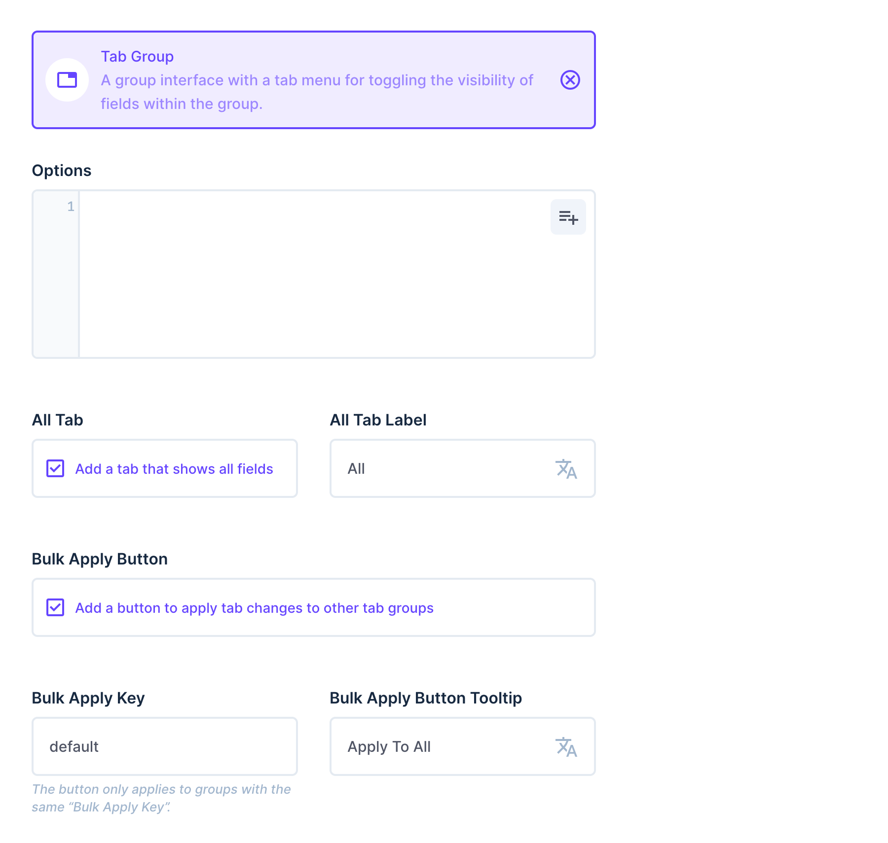

# Tab Group Interface for Directus

[](https://www.npmjs.com/package/directus-extension-tab-group)

A group interface with a tab menu for toggling the visibility of fields within the group.

## Use case

The main use case for this extension is to provide an alternative solution to the translation interface. You can use this tab group interface to toggle fields individually or some of them or all of them together as you like. For example, you can toggle the visibility of a `title_de` and a `title_en` field. In addition you can apply tab changes to other tab groups by using the `Bulk Apply Button`.

<video src="https://github.com/formfcw/directus-extension-tab-group/assets/78852214/7e4ce55d-cabb-4792-95b7-88be3b361eea" controls="controls" muted="muted"><a href="https://github.com/formfcw/directus-extension-tab-group/assets/78852214/7e4ce55d-cabb-4792-95b7-88be3b361eea">Watch video</a></video>

## Options

In your interface settings, you can use a JSON field to specify which button displays which fields, like:

```json
[
    {
        "label": "Deutsch",
        "active": true,
        "fields": [
            {
                "name": "title_de",
                "activeWidth": "full"
            }
        ]
    },
    {
        "label": "English",
        "fields": [
            {
                "name": "title_en",
                "activeWidth": "full"
            }
        ]
    },
    {
        "label": "Deutsch + English",
        "fields": [
            {
                "name": "title_de",
                "activeWidth": "half"
            },
            {
                "name": "title_en",
                "activeWidth": "half"
            }
        ]
    }
]
```

There are also options to add an `All` tab to display all fields as specified and to add a `Bulk Apply Button` to other tab groups (using the same `Bulk Apply Key`).



---

## Overwriting styles

Use the following classes to customize CSS styles via the Directus Project Settings: `.tab-group`, `.tab-group .menu` or `.tab-group .menu .menu-item`.

Example:

```CSS
/* disable the vertical bar */
.tab-group::before {
	content: none !important;
}
```
